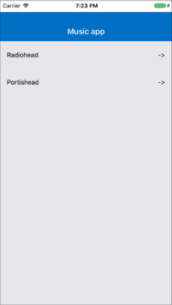

# Facebook Arsenal

Starter kit for creating full-stack javascript apps with cutting edge Facebook development tools. It contains a React Native project with Relay modern support and a NodeJS + GraphQL server.

This repository also proposes a way to organize a large GraphQL server by creating separated modules.

The goal with this project it's to figure it out what are the best practices for integrating this technologies.

Work in progress, use it at your own risk.

---

---

## How to run it

Run this two script in different terminal window.

1. Terminal 1:
```bash
$ cd server && npm install
$ npm start
```

1. Terminal 2:
```bash
$ cd app && npm install
$ react-native run-ios
```

This example works out of the box, but if you change the GraphQL API you will need to compile your schema to make it work with Relay. The backend server needs to be running to perform this:

1. In your React Native root project folder:

```bash
$ npm i get-graphql-schema -g
$ get-graphql-schema http://localhost:3001/graphql > ./schema.graphql
$ npm i relay-compiler -g
$ relay-compiler --src ./src --schema ./schema.graphql
```
You need to do this everytime you change your GraphQL API or everytime you change your Relay queries. I'm looking forward to automate this process.

## Why this matters

It took me a lot to figure it out how to integrate Relay Modern in React Native and I don't want to start from scratch again. If you're planning to create something with this stack, maybe this could be helpful.

## Lessons learned so far:
1. GraphQL connections are not necessary to use Relay.
1. GraphQL connections are useful with 1->N relationships in data.
1. You don't need a Viewer object on the root of your GraphQL endpoint (all the Relay docs has it).
1. Relay classic sucks, Relay Modern is easier.
1. You should create a QueryRenderer for every Relay Query to GraphQL and a fragmentContainer for every React module that uses Relay data.
